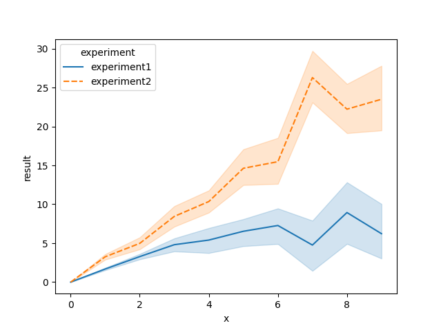

# Experiment Sweep

Helper functions for sweeping experiment parameters and collating data.  Useful for Monte Carlo simulations.

## Usage

Basic example

``` python
from expsweep import combination_experiment

def exp(a, b, c):
    return {
        'sum': a + b + c
    }
    
result = combination_experiment(
    exp,
    a=[1, 2, 3, 4],
    b=[1, 2, 3, 4],
    c=[1, 2, 3, 4],
    cpu_count=32
)

"""
result
    a  b  c  sum
0   1  1  1    3
1   1  1  2    4
2   1  1  3    5
3   1  1  4    6
4   1  2  1    4
.. .. .. ..  ...
59  4  3  4   11
60  4  4  1    9
61  4  4  2   10
62  4  4  3   11
63  4  4  4   12
"""
```

Monte Carlo Simulation with Seaborn Plotting

``` python
from expsweep import combination_experiment

# monte carlo simulation for 3 algorithms
def exp(snr):
    sample_data = generate_samples(...)

    our_error = our_method(snr, sample_data)
    guizar_error = guizar_method(snr, sample_data)
    ginsburg_error = ginsburg_method(snr, sample_data)
    
    return {
        'Ours': our_error,
        'Guizar': guizar_error,
        'Ginsburg': ginsburg_error
    }
    
result = combination_experiment(
    exp,
    snr=np.linspace(-40, -15, 10),
    iterations=50
    category_name='method',
    value_name='error'
)

import seaborn as sns
plot = sns.lineplot(
    data=result,
    x='snr',
    y='error',
    hue='method',
    style='method',
)
    
```



## Troubleshooting

    AttributeError: Can't pickle local object ...
    
Define the variable in question as a global

